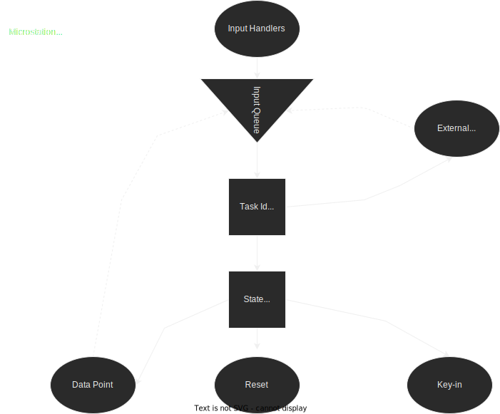

# Modules

## Contents && Articles

### Overview

#### What you can do with MDL

- Develop tightly **integrated interactive applications** that

run inside MicroStation and

"look and feel" like a part of MicroStation.

In fact, many features of MicroStation are implemented as MDL applications.

- **Extend or customise** the existing features provided in MicroStation
with the help of wide range of APIs,
delivered as collection of libraries
with MicroStation SDK.

- Enable **UI** related data to be
organised for efficient **translation** for foreign language markets.

#### MDL Application Organization

There are *two* basic approaches to developing applications using MDL.

1. The first is to use the **input handling functions**,
**activate MicroStation commands**,
and **simulate operator inputs**,
**sequencing them** as appropriate.

2. The second approach is to **call** the equivalent **functions in the MDL built-in library**, accomplishing the same tasks **without activating MicroStation commands**.

Of these two approaches, the second is distinctly superior.

Applications developed with built-in library functions are
- more reliable,
- more predictable, and
- more efficient
than those that sequence MicroStation commands.

2. Applications that sequence MicroStation commands have the following problems :

2. They require a complete knowledge of inputs to the MicroStation commands used.
Making them work exactly like other MicroStation commands is difficult.

2. For example, they must manually allow windowing and intermediate commands.
**Multiple applications cannot be active** at the same time,
because one application must drive MicroStation.

2. Therefore, when possible,
MDL applications **should not use**
the input handling functions
to sequence MicroStation commands.

All MicroStation primitive commands operate in a similar manner;
they accept input as
- data points,
- resets and
- key-ins.

They also allow
- windowing commands and
- immediate commands
to operate transparently
and work with
- selection sets if applicable.

Good MDL applications should operate similarly and, in effect,
become part of MicroStation.

Users should not be able to distinguish
a properly constructed **MDL program**
from an **internal MicroStation** command.

The key to accomplishing this transparency is
**creating MDL applications**
that are **event-driven**.

**Event-driven applications** do not become suspended
while awaiting a specific **type of input**,
such as a **key-in** or a **data point**.

Rather, they establish functions, or state handlers,
that are called when **various events occur**.
These handlers process the input and establish new handlers when appropriate.

The following diagram of MicroStation's input loop
illustrates the concept of **event-driven applications**:

The **input queue** is at the heart of MicroStation's input loop.

All events input to MicroStation
are gathered by **the input handlers**,
such as keyboard,
- mouse,
- tablet and
- external programs and put in the input queue.

When the event reaches the head of the queue,
the **task ID dispatcher** processes it.

The dispatcher sends the event to the appropriate application.

If your MDL application is **sequencing MicroStation commands**,
the application becomes responsible
for fully processing the event.

If no application is designated for the event,
the default processor, the **state dispatcher**,
assumes control.

The **state dispatcher** preprocesses the event and then calls the appropriate state handler that you designated in your MDL application.

See "Input Handling Functions" in the MicroStation MDL Function Reference Manual for more information on using the input handling functions. See the MicroStation MDL Function Reference Manual for more information on using the state functions.
