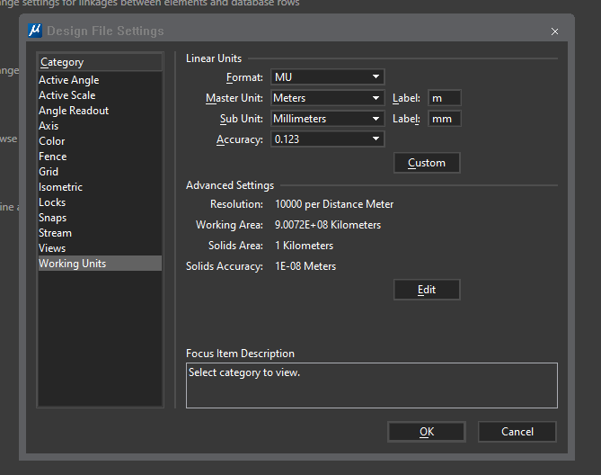

# Native (C++) - Step By Step Guide

This series of articles will provide you a step by step guide to learn MicroStation CONNECT edition MDL development.

Chapter 0: [Introduction and Prerequisites](https://communities.bentley.com/products/programming/microstation_programming/w/wiki/52105/introduction-and-prerequisites)

Chapter 1: [Building a simple MDL Application](https://communities.bentley.com/products/programming/microstation_programming/w/wiki/52106/building-a-simple-mdl-application)

Chapter 2: [Detailed explanation of mke file](https://communities.bentley.com/products/programming/microstation_programming/w/wiki/52111/detailed-explanation-of-mke-file)

Chapter 3: [Creating elements in MDL applications](https://communities.bentley.com/products/programming/microstation_programming/w/wiki/52114/creating-elements-in-mdl-applications)

Chapter 4: [Adding commands to MDL applications](https://communities.bentley.com/products/programming/microstation_programming/w/wiki/52115/adding-commands-to-mdl-applications)

Chapter 5: [Creating a VS project and debugging the application](https://communities.bentley.com/products/programming/microstation_programming/w/wiki/52126/creating-a-vs-project-and-debugging-the-application)

Chapter 6: [Implementing Interactive tools using DgnTools Class](https://communities.bentley.com/products/programming/microstation_programming/w/wiki/52127/implementing-interactive-tools-using-dgntools-class)

Chapter 7: [Adding User Interface to a MDL Application](https://communities.bentley.com/products/programming/microstation_programming/w/wiki/52143/adding-user-interface-to-a-mdl-application)

Chapter 8: [Launching applications through the customized interface](https://communities.bentley.com/products/programming/microstation_programming/w/wiki/52144/launching-applications-through-the-customized-interface)


## Chapter 0: Introduction and Prerequisites

## Chapter 1: Building a simple MDL Application

/***
Building an introductory MDL Application

This topic will guide you step by step 
to build a native MDL application 
to load and run within MicroStation CONNECT Edition, MSCE.

1. 
Create a folder for the project source code, 
e.g. /dev/C++.MsCeMdl01.cpp (or a preferred location).

2. 
Start a Text Editor (or IDE) 
and either type, or copy and paste 
the following text and save it as file: 
e.g. /dev/C++.MsCeMdl01/MsCeMdl01.cpp. 

This file contains the function MdlMain (an entry point) 
that will be executed upon loading of an application. 

In this example we simply call an MDL C API function 

mdlDialog_dmsgsPrint 

that will open and display a text message in 

a dialogue message box.

Some explanations of the code above are as follow:

    The header files in the MSCE SDK are stored within a hierarchy of folders, 
    and paths to header files are required, similar to Mstn/MdlApi/MdlApi.h below.
    
    This MdlApi.h header file is very important 
    and should be included first (or before) 
    to ensure other header file dependencies used by other classes and functions 
    can be resolved properly.
    
    The entry function of an MDL program must be called 
    
    - MdlMain 
    
    and its parameters are 
    - int and 
    - WCharCP 
    
    Note that the second parameter of the MSCE version of MdlMain 
    has changed from V8i's char* to WCharCP (ie WChar const *). 
    This is also an important difference between MSCE SDK and V8i SDK: 
    all parts related to the text must be used instead of Unicode;
    
    extern "C" causes the MdlMain function 
    to be generated in the obj file 
    in the form of C language instead of C++, 
    so as to ensure that no function overload occurs;
    
    DLLEXPORT is defined as __declspec(dllexport), 
    indicating that the MdlMain function needs to be exported.

3.

Type the following in a text editor 
and save it as the file 
/dev/C++.MsCeMdl01/MsCeMdl01.r

# Code explanations
# 
# DllMdlApp is a structure 
# 
# typedef struct dllMdlApp
# {
# wchar_t            taskId [DGNPLATFORM_RESOURCE_TASK_ID_SIZE ];     // WIP_NONPORT
# wchar_t            dllName [DGNPLATFORM_RESOURCE_MAXFILELENGTH];    // WIP_NONPORT
# } DllMdlApp;
# 

# defined in the rscdef.r.h file. 
# 
# It consists of two parts: 
# - TaskId and 
# - DLL name;
# 
# TaskId can basically be understood as the name of the ma file, 
# but it does not completely correspond. 
# 
# TaskId will be automatically converted to all uppercase characters 
# and has a length limitation. 
# 
# Only when the name of your ma file is very long, 
# will the TaskId be different from the file name;
# 
# The MDL program consists of two files: 
# an 
# - ma     file and a 
# - dll    file. 
# 
# When loading, first find the ma, 
# and then find the corresponding .dll file 
# to load through the DllMdlApp structure. 
# 
# Under normal circumstances, 
# we will keep the names of ma and dll the same, 
# but of course, they may be different.
# 

The 

DllMdlApp resource 

is defined in this file. 

The function of this resource is 
to associate the MA 
(actually not the MA file name but the task identifier, taskid) 
​​with the specified DLL file.

4. 
Copy and paste the following content into a file called 

MsCeMdl01.mke 

and save it under /dev/C++.MsCeMdl01. 

This file is the control file for generating the project. 

During the project generation process, 
bmake reads the content of the file 
and then calls the corresponding compiler and linker 
to generate the final MA and DLL from the source file.

This mke file controls the generation process 
of the entire project, 
and its content is relatively complicated. 
Please see the next topic for a detailed introduction.

5. Right-click 
"Start > All Programs> Bentley > MicroStation CONNECT Edition SDK > MicroStation CONNECT Edition SDK", 
and select "Run as administrator" 
from the pop-up menu 
to start the MDL program development environment. 

After the development environment command prompt, 
type cd /d /dev/C++.MsCeMdl01 
and press Enter to enter the directory 
where our project is located, 
and then type 

bmake -a 

to generate MsCeMdl01.ma and MsCeMdl01.dll. 

These generated files are located 
in the …\MicroStation\mdlapps directory.

*/

/*----+ | MsCeMdl01.cpp | +----*/


## Chapter 2: Detailed explanation of mke file


Source [Bentley Makefile](https://communities.bentley.com/products/programming/microstation_programming/w/wiki/52111/detailed-explanation-of-mke-file "source of remarks below")

The old version of MicroStation 
supports cross-platform development, 
so its development architecture 
does not follow the Microsoft system, 
but uses a Unix/Linux like development system, 
which uses *production files* 
rather than *registry entries* 
to control the entire project generation process. 

If you have developed with GCC under Unix or Linux, 
I believe that this system will have a familiar feel. 

The following figure 
is a complete process 
of generating ma and dll:

MDL_SSG_BuildFlowChart.png-1043x578.png

The shaded blocks are the source code (with header files, resource files, type files, and C ++ files), which we need to write by hand; rectangular blocks are some executables, including resource compilers, type generators, and MDL library wrappers, C ++ source file compiler, target object linker, etc. Other blocks are generated intermediate files or final files.

The resources in an MDL program are divided into 
- command table resources, 
- dialogue resource, 
- message resource, 
- type resource, 
- etc. 

They are all finally generated into the file **ma** 
(**ma** is the abbreviation of **MicroStation Application**). 

These are unique to Bentley, 
and these resource files must be written in accordance 
with the prescribed syntax. 

The process of generating C ++ source files to dynamic link libraries in MDL is the same as the compilation and linking process of ordinary C ++ files, 
which is to invoke the compiler **cl.exe** 
under Microsoft VS to generate the obj file 
and then link the obj file (maybe multiple) 
into a dll file by invoking the linker **link.exe**. 

The almost independent processes 
of these two parts 
are controlled by a single **mke** file.

Below we use the mke file from the previous chapter as a basis to explain in detail the syntax of this production file.

- Comments  
    Lines that begin with **#** are comment lines. 
    These lines are ignored by the **bmake** command while processing the mke file. 

- Macro definition  
    Such as ***appName = HelloWorld***
    *appName* is called the macro name and 
    *HelloWorld* is called the value of the macro. 

- Macro expansion  
    Expressed as $(macro name)
    $(appName)$(oext) 
    is expanded to 
    ***HelloWorld.cpp***.

- Dependency    
    For example, 
    $(o)$(appName).rsc: $(baseDir) $(appName).r, 
    the former depends on the latter.
    When the latter is modified, 
    the former needs to be regenerated.
    Otherwise, such lines are ignored.
    The purpose of this is 
    to speed up the generation of the entire project 
    and only generate the target file for the modified content.

- Rules  
    such as
    ```
    $(mdlapps) $(appName).ma: $(appRscs) 
        $(msg) 
        >$(o) make.opt 
        -o $ @ 
        $(appRscs) 
        < 
    $ (RLibCmd) @ $ (o) make.opt 
        ~ time 
    ```

    When $(appName).ma is generated from $(appRscs), 
    there are no default rules in all mki (header files for making files). 

    Here are the explicit rules

    The final call is the command **RLibCmd** $(RLibCmd) 
    to package multiple rsc files 
    into a single ma file

    ***RLibCmd*** $(RLibCmd) is actually ***rlib.exe*** 
    under the bin folder in the SDK. 

**Note** 

If there is 
a ***blank line under a dependency*** 
without directly following a rule, 
it means 
to ***find the default rule in mki***.

- Statements  
    such as 

    **%include** or 

    **%ifdef**, 

    etc. 

    that begin with **%**. 
    
    Either perform an **include action** 
    or perform some **conditional branch** functions. 
    
    The detailed **mke** file syntax 
    can be found in creating a Makefile and Using the bmake Utility section of the SDK help document **MicroStationApi.chm**. 
    
    For a deeper understanding of mke files, you also need to read the system's mki files, which define many of the system's built-in macro definitions and rules. 

Next, we summarise a few points you need to care about in practice. 
As long as you grasp these points, 
you can basically create new mke files and modify mke files in the future.

- **appName**  
defines the project name. 
When you want to create a new project, you need to copy a folder, 
modify the file names, 
and modify the value of the appName macro in the **mke** file to the name of your new project.

- Each **additional .cpp file** 
    needs to modify the definition of **appObjs** 
    and add a line to generate obj. 
    Note that the backslash symbol at the end of a line 
    is a line continuation character. 
    **There must be no spaces after the line continuation character.**
    ```
    $ (o)XXX $(oext) : $ (baseDir)XXX.cpp $ (baseDir)XXX.h
    ```

- If a function in another library is called, 
    the library file name containing the function 
    needs to be added to the **LINKER_LIBRARIES** macro definition.

- If you reference header files from another directory, 
you need to set **dirToSearch** to point to the folder where the new header files are located, and then include mki.

- Depending on the project, 
    it may contain 
    -- command list resource files,  
    -- dialogue resource files,  
    --- and so on.  
    
    Each resource file 
    needs to be defined 
    in the ***appRscs*** macro, 
    similar to a cpp file. 
    
    Each time 
    you add a resource 
    source file.r will add a line 
    from. r generates the definition of .rsc. 
    
    The command-line processing line 
    has been defined in mke, 
    you only need to cancel the comment symbol # at the beginning of the line.

Learn More about the Bmake Utility here : 


[Creating a Makefile and Using the bmake Utility](https://communities.bentley.com/products/programming/microstation_programming/w/wiki/51431/creating-a-makefile-and-using-the-bmake-utility/ "bmake & *.mke")


## Chapter 3: Creating elements in MDL applications

MicroStation has many types of elements  
that we can divide into graphical and non-graphical elements.  

This chapter will discuss how to create **graphical elements** in MDL programs. 

Because the **CE SDK** encapsulates the ***original C function***s,  
it provides **a new set of methods for creating elements**.  

The following table lists most of the **graphic elements**  
supported in MicroStation. 

It also lists the **old methods** and **new methods** of creating elements.

element | function | note
:-------:|----------|-------|
=> Line | mdlLine_create <br> ICurvePrimitive::CreateLine <br>  LineHandler::CreateLineElement  | A line consiting of two points  
=> PointString | mdlPointString_create <br> ICurvePrimitive::CreatePointString <br> PointStringHandler::CreateLineStringElement  |  Discrete points consisting of up to 2000 points.  
=> LineString | mdlLineString_create <br>  ICurvePrimitive::CreateLineString <br> LineStringHandler::CreateLineStringElement  |  Multi-segment line consisting of up to 5000 points. mdlElmdscr_createFormVertices can create complex LineString with more than 5000 points.  
=> Shape | mdlShape_create <br>  ICurvePrimitive::CreateRectangle <br>  CurveVector::CreateLinear <br>  ShapeHandler::CreateShapeElement  |  Closed straight line segment consisting of up to 5000 points. *mdlElmdscr_createFormVertices* can create complex LineString with more than 5000 points. *mdlElmdscr_createShapeWithHole* can create hollow shape. 
=> Arc | mdlArc_create <br>  mdlArc_createByCenter <br>  mdlArc_createByDEllipse3d <br>  mdlArc_createByPoints <br>  ICurvePrimitive::CreateArc <br>  ArcHandler::CreateArcElement  | n/a 
=> Ellipse | mdlEllipse_create <br>  mdlCircle_createBy3Pts <br>  CurveVector::CreateDisk <br>  EllipseHandler::CreateEllipseElement | Circle and Ellipses are the same element type.
=> ComplexChain ComplexShape | mdlComplexChain_createHeader <br> ChainHeaderHandler::CreateChainHeaderElement <br> ChainHeaderHandler::AddComponentElement <br> ChainHeaderHandler::AddComponentComplete | This function creates complex elements, and then appends elements, such as lines and / or arcs to form the final ComplexChain or ComplexShape.  
=> Curve | mdlCurve_create <br> CurveHandler::CreateCurveElement | The simple type of curve that passes through the points you specify.
=> BsplineCurve | mdlBspline_createCurve <br> mdlBspline_createInterpolationCurve <br> BSplineCurveHandler::CreateBSplineCurveElement | Can build MSBsplineCurve with *mdlBspline_createBsplineFromPointAndOrder*
=> Multiline | mdlMline_create <br> MultiLineHandler::CreateMultiLineEement | Multiple straight lines consisting of up to 16 lines
=> Text | TestHandlerBase::CreateElement <br> TestHandlerBase::TextBlock | Text element. The old method will be deprecated in the future
=> TextNode | TestHandlerBase::CreateElement <br> TestHandlerBase::TextBlock | Text with multiple styles in single or multiline text. 
=> Tag | mdlTag_create | text associated with a graphical element. Tag will be replaced by item.
=> Dimension | mdlDim_create <br> DimensionHandler::CreateDimensionElement | n/a
=> Cell | mdlCell_create <br> mdlCell_placecCell <br> mdlCell_getElmDscr <br> mdlCell_getElmDscr <br> Extended <br> NormalCellHeaderHandler::CreateCellelement | mdlCell_create does not rely on the cell library to create a cell header. mdlCell_placeCell or mdlCell_getElmDscr can directly read a cell from the cell library.
=> SharedCell | mdlSharedcell_create <br> SharedCellHandler::CreateSharedCellElement | Multiple SharedCells shared one ShareCell definition. It could be used to significantly reduce model size when there are multiple identical complex cells
=> Cone | mdlCone_create <br> ConeHandler::CreateConeElement | This function can be used to create both cylinders and cones
=> SurfaceSolid | mdlSurface_project <br>  mdlSurface_resolve <br>  SurfaceOrSolidHandler::CreateProjectionElement <br>  SurfaceOrSolidHandler::CreateresolutionElement | For two old functions you can set edp->el.ehdr.type = SOLID_ELM to generate solid. In the new two functions, there is a preferSolid flag which can be used to control whether to generate surface or solid.
=> SmartSolid | mdlKISolid_makeCuboid <br> mdlKISolid_makePrism <br> mdlKISolid_makeSphere <br> mdlKISolid_makeCone <br> mdlKISolid_makeTorus <br> mdlKISolid_makeWedge <br> mdlKISolid_sweepodyWire <br> ISolidPrimitive::CreateDgnTorusPipe <br> ISolidPrimitive::CreateDgnCone <br> ISolidPrimitive::CreateDgnBox <br> ISolidPrimitive::CreateDgnSphere <br> ISolidPrimitive::CreateDgnExtrusion <br> ISolidPrimitive::CreateDgnRotationSweep <br> ISolidPrimitive::CreateDgnRuledSweep <br> SolidUtil::Create | *SmartSolid* handles geometry with the help of the *ParaSolid*, but the *ordinary solids* do not. Therefore, for some basic 3D model, both *ordinary solid* and *SmartSolid* can be used to create them. The *ordinary solid* is more efficient than the *SmartSolid*, but it cannot express complex solids.
=> BsplineSurface | mdlBspline_createSurface <br> mdlBspline_crossSectionSurface <br> mdlBspline_gordonSurface <br> mdlBspline_coonsPatch <br> mdlBspline_nSidePatch  <br> mdlBspline_skinPatch <br> mdlBspline_ruledSurface <br> mdlBspline_surfaceOfProjection <br> mdlBspline_surfaceOfRevolution <br> mdlBspline_catmullRomSurface <br> MSBsplineSurface::CreateXXX | Accurate surface expression.
=> Mesh | mdlMesh_newCoordinateBlock <br> mdlMesh_newGrid <br> mdlMesh_newPolyface <br> mdlMesh_newRegularPolyhedron <br> PolyfaceHeader::CreateXXX | Mesh is suitable for expressing large-scale ground model mesh data, but the accuracy will be worse than BsplineSurface.

In the **CE SDK**,   

most of the old C functions are still retained, 

but their function prototypes have changed.

The main reason is that the CE version completely uses **Unicode character encoding**.

*This chapter* will only introduce **the new C++ programming method**. 

One of the most important classes in CE SDK is **ElementHandle**,  
whose object represents **an element in memory**.

MDL defines multiple variants for the same class,  
the purpose of which is to simplify the writing of C++ itself.

As shown in the following table: 

Class Name | Actual Definition
---------- | -----------------
ElementHandleP | ElementHandle * 
ElementHandleCP | ElementHandle const *
ElementHandleR | ElementHandl &
ElementHandleCR | ElementHandle const &

- This code consists of **four functions**  
that demonstrate 
    - how to create a line, 
    - a complex shape, 
    - a solid, and 
    - a B-spline surface.

- There are two **header files** 
    - MdlApi.h
    - DgnPlatformApi.h,  
    which contain most of the 
    - class definitions and 
    - function prototypes   
    that we can use.

- Three **namespaces**  
    - Bentley::DgnPlatform, 
    - Bentley::MstnPlatform, and 
    - Bentley::MstnPlatform::Element  
    were introduced.  

Instead of using  
the C++ standard  
**using namespace** syntax,  
the three predefined macros in MDL are used directly.  

Note 

these three lines do not need to end with a semicolon,  
because the macro definition already contains a semicolon.

- Because  
the **default unit in MDL** is  
**UOR (Unit of Resolution)**  
instead of the 
**main unit in MicroStation**,  
we define a **global variable g_1mu**   
to represent a **main unit**. 

In the **MdlMain** function,  
assign **UorPerStorage** to g_1mu.  

For the relationship between the  
- main unit, 
- sub unit and 
- resolution unit,  
please refer to the following figure.  

Select the menu  
- File
- Settings
- File 
- Design File Settings  
to open this dialogue box:




- The **createALine** function creates a line.  
First construct the *DSegment3d* object seg,  
which represents the two endpoints of a single line segment, then call *CreateLine*  
using the *ICurvePrimitive* interface  
to create the *geometry* of the line segment,  
and then call the *ToElement* function using *DraftingElementSchema* to convert the *geometry* into an *EditElementHandle* object *eeh*,  
and finally call the *AddToModel* function  
to eeh Added to the model.  
This kind of thinking is a great change of MicroStation CE SDK.  
*Geometry* can be understood as a universal geometric expression that has nothing to do with MicroStation.  
Only after being converted to *EditElementHandle*,  
it becomes *an element of MicroStation*.

- The **createAComplexShape** function creates a complex shape consisting of arcs and line strings. First create a CurveVector of type BOUNDARY_TYPE_Outer. CurveVector is a dynamic array (Vector in STL) composed of ICurvePrimitive, which can be used to express complex elements such as Complex Chain or Complex Shape. Then call ICurvePrimitive::CreateArc and ICurvePrimitive::CreateLineString respectively to create an arc and a line string to add to the CurveVector, and finally call DraftingElementSchema::ToElement like createALine to generate an EditElementHandle and add it to the model.

- The **createAProjectedSolid** function generates an extruded volume based on a section. First create a CurveVector that expresses the section, then create a DgnExtrusionDetail geometric data based on this section and the extrusion vector, and then call ISolidPrimitive::CreateDgnExtrusion to create an extruded volume. ISolidPrimitive is used to represent the basic geometric entities defined by Bentley, while ISolidKernelEntity is used to represent any complex entity expressed using the ParaSolid kernel.

- The **createABsplineSurface** function generates a Kongs surface from four arcs. Since no suitable member function was found in the MSBsplineSurface class, we continue to call the MDL C function mdlBspline_coonsPatch. Because neither MSBsplineSurface nor MSBsplineCurve uses smart pointers (the ones that end in Ptr are all smart pointers defined in MDL), you need to explicitly call mdlBspline_freeSurface and mdlBspline_freeCurve to release memory, otherwise memory leaks will occur.


## Chapter 4: Adding commands to MDL applications


## Chapter 5: Creating a VS project and debugging the application


## Chapter 6: Implementing Interactive tools using DgnTools Class


## Chapter 7: Adding User Interface to a MDL Application


## Chapter 8: Launching applications through the customized interface
