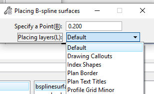
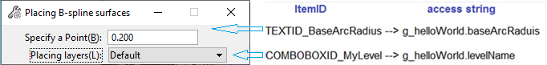

# Adding User Interface to a MDL Application

We implemented

the **dynamic placement** of **B-spline curves**

in the previous chapter of this series. 

Now add the following graphical user interface (GUI) to this tool:

Adding this interface

can help us specify the **size**

of the surface and

its **layer** when placing the surface.

In a native code application,

you can add a graphical user interface

applying **MDL resources (.r files)**

or **MFC resources (.rc files)**. 

The former is unique to Bentley applications, and the latter is Microsoft's approach.

Although **MDL resources**

***do not support visual design***,

it supports user interaction

by defining data

without writing program code,

which is relatively simple. 

Furthermore,

you can integrate

the existing **dialogue entries**

(known as **controls**)

in MicroStation into your own **dialogues**,

which is another great benefit of MDL resources. 

In short, MDL resources play an extremely important role in writing native-code programs.

Most of Bentley's internal code is written through MDL resources.

MFC resources are rarely used (some are written using the latest WinForm WPF).  

For more information on MDL resources,

please refer to

**Dialog Box Manager Overview**,

**Standard dialog items**

and

**Dialog Hook Functions**

in MicroStationApi.chm.

In this example,

we will focus on the above two dialogue entries.

In order to implement this interface,

we need to make some design considerations:

we need to assign an identifier (ID)

to each dialogue box and dialogue item

to make it easier to use and reference in resources and code.

We also need to specify

most dialogue items **Access strings**

for quick and direct access

to the values they reference.

In this example,

the defined entry ID and access string are shown below:

For the same resource,

the ID value of each item must be unique. 

The ID values ​​of items of different resource types need not be unique.

The combo box entry **COMBOBOXID_MyLevel** is used

to display all valid **levels** in the current design file. 

The combo box entry is different from the general entry.

It does not have a default standard action,

so you need to add a **hook function** to it, which is why we also need to define **HOOKITEMID_MyLevelCombo**.

Normally, all **access strings**

are defined in a structure

and published in .mt and .cpp files.

Note the definition of ItemList in CE.

It will appear

in the subsequent r

and ordinary .r

to associate the command
with the tool setting dialogue box.

**MsCeMdl01.r**

a.

The command **CMD_MSCEMDL01_CREATE_BSPLINESURFACE**

corresponds to **ItemList_BsplineSurface**,

and **ItemList_BsplineSurface** defines two item lists. 

When a command is processed and becomes the current command,

MicroStation will find the **CmdItemListRsc** resource

associated with the command

and display its content in the **Tool Settings dialogue box**;

b.

We have defined a **text entry resource**

for the Base Radius. 

15 is the maximum number of characters

that can be entered in the text entry. 

**"%W"** indicates

that the value in the text entry will be displayed in **work unit format**. 

The tilde in **(~B)** indicates

that the B character is underlined

- this is what we usually call a mnemonic. 

When the tool setting dialogue is focused,

press **Alt + B** to select the text entry. 

**g_mscemdl01.baseArcRadius** is the **access string**

for this text entry. 

We can use this variable to **get or set the value** of this text entry.

c.

In the same way,

we have defined a **combo box entry resource**

for the **"placement layer"**. 

The content of a **combo box entry**

often **needs to be assigned by code**.

To this end, a **hook entry ID**

**HOOKITEMID_MyLevelCombo**

is defined in the resource file

and associated with the entry. 

In the future,

a hook function in the .cpp file

should correspond to the hook entry ID. 

Therefore, when the user operates the item,

the hook function in cpp can be called.
